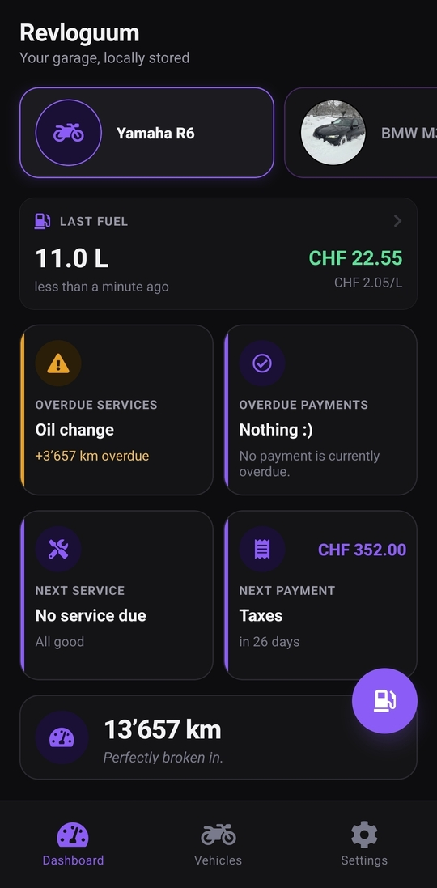
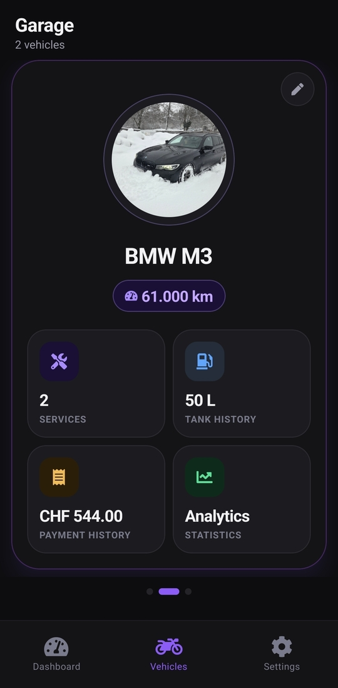
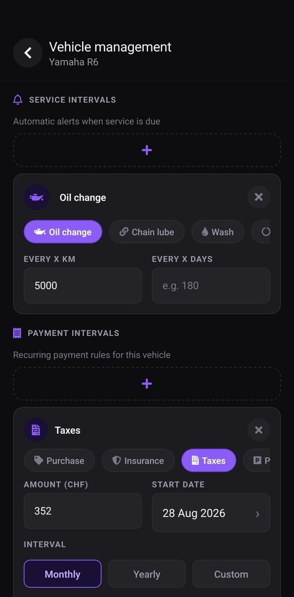
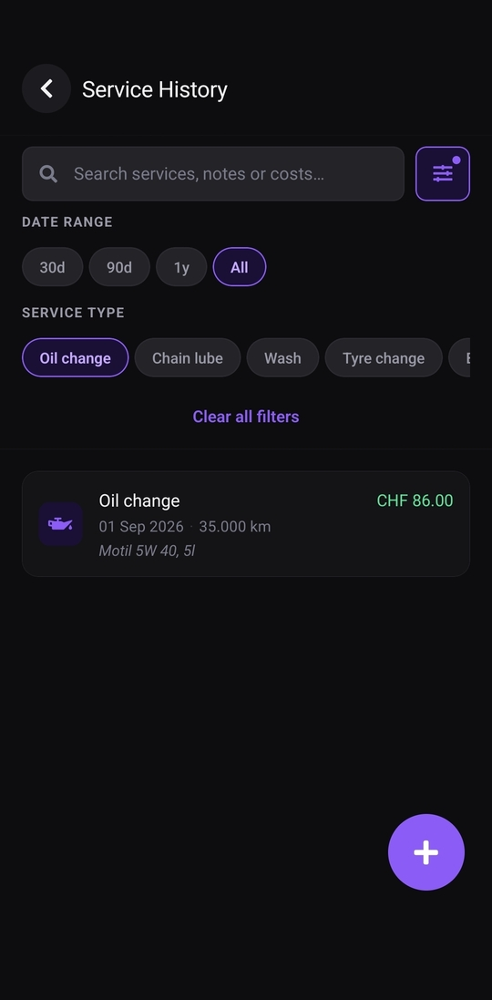
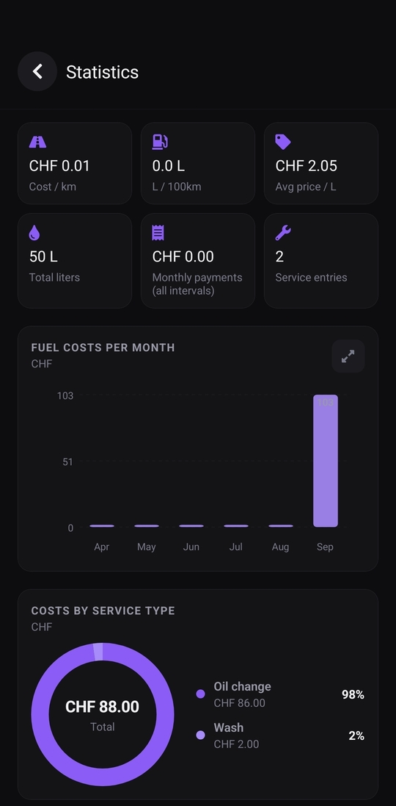
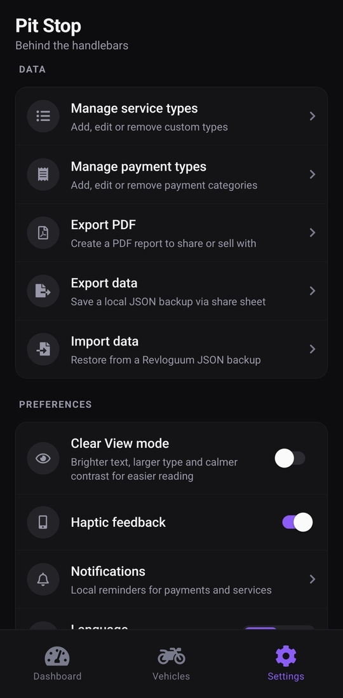

# Revloguum

Revloguum is a local-first vehicle journal for tracking maintenance, fuel, recurring payments, documents, and ownership costs without requiring an account or application backend.

## Screenshots

<table>
	<tr>
		<td align="center" width="33%">
			<br>
			<strong>Dashboard</strong><br>
			<sub>Last fuel entry, due services, payments, and quick fuel access.</sub>
		</td>
		<td align="center" width="33%">
			<br>
			<strong>Garage</strong><br>
			<sub>Swipe between vehicles and open service, fuel, payment, or statistics views.</sub>
		</td>
		<td align="center" width="33%">
			<br>
			<strong>Vehicle management</strong><br>
			<sub>Configure service schedules and recurring payment intervals per vehicle.</sub>
		</td>
	</tr>
	<tr>
		<td align="center">
			<br>
			<strong>Service history</strong><br>
			<sub>Search and filter maintenance records, notes, costs, and service types.</sub>
		</td>
		<td align="center">
			<br>
			<strong>Payment history</strong><br>
			<sub>Review ownership costs and attach receipts or multi-page documents.</sub>
		</td>
		<td align="center">
			<br>
			<strong>Statistics</strong><br>
			<sub>Compare fuel, mileage, service, payment, and cost trends.</sub>
		</td>
	</tr>
	<tr>
		<td align="center">
			<br>
			<strong>Settings</strong><br>
			<sub>Manage types, encrypted backups, PDF reports, reminders, and accessibility.</sub>
		</td>
		<td colspan="2">
			Screenshots show the English interface. Revloguum also includes a complete German interface. Vehicle photos and values shown here are demonstration data.
		</td>
	</tr>
</table>

## Features

- Manage multiple motorcycles, cars, and other vehicles
- Record individual services or grouped workshop visits with notes and photos
- Track fuel entries, consumption, prices, and mileage
- Track one-time costs and recurring payment intervals
- Configure service and payment reminders as local notifications
- Store multi-page vehicle, service, and payment documents from camera or gallery
- Review cost, fuel, mileage, service, and tyre statistics
- Generate configurable vehicle reports as PDF
- Export and restore password-encrypted backups
- Switch between English and German
- Use the optional Clear View readability mode

The complete functional behavior and known calculation limits are documented in [USECASES.md](USECASES.md).

## Privacy and Security

Core vehicle data is stored on the device. Revloguum has no account system and the application code does not send personal vehicle data to a Revloguum backend or analytics service.

- The SQLite database is configured to use SQLCipher.
- Persistent vehicle photos, service photos, and document pages are individually encrypted.
- Backups use password-based authenticated encryption.
- PDF reports are not encrypted and may contain sensitive information.
- Sharing a PDF or backup sends it to a destination chosen through the operating system.

See [PRIVACY.md](PRIVACY.md) for data handling and permissions. See [SECURITY.md](SECURITY.md) for the threat model, cryptographic controls, limitations, and vulnerability reporting.

## Technology

- React Native 0.86 and React 19
- Expo SDK 57
- TypeScript
- Expo SQLite with SQLCipher
- React Navigation
- Zustand
- i18next

The code is organized as `domain -> data -> hooks -> screens`. Persistence belongs in SQLite repositories, shared application state belongs in Zustand, and navigation belongs in React Navigation.

## Development

### Prerequisites

- Node.js and npm supported by the installed Expo SDK
- Android Studio and an Android SDK for Android development
- macOS with Xcode for iOS development
- A simulator/emulator or physical development device

Revloguum uses native modules including SQLCipher and platform key storage. Use a native development build; Expo Go is not a supported runtime for the complete app.

### Install and run

```bash
npm ci
npm run android
```

On macOS, use `npm run ios` for iOS. `npm start` starts the Expo development server for an already installed compatible development build.

Fork maintainers should replace the Expo owner/project ID, Android package name, and iOS bundle identifier in [app.json](app.json) before publishing builds under their own identity. Build profiles are defined in [eas.json](eas.json).

### Validation

```bash
./node_modules/.bin/tsc --noEmit --pretty false
git diff --check
```

There is currently no automated test suite. Security-sensitive and user-facing changes require focused manual testing on the affected mobile platforms; the checklist is in [CONTRIBUTING.md](CONTRIBUTING.md).

## Documentation

- [USECASES.md](USECASES.md): detailed functional use cases and limitations
- [SECURITY.md](SECURITY.md): security model and reporting process
- [PRIVACY.md](PRIVACY.md): local data handling, permissions, exports, and retention
- [CONTRIBUTING.md](CONTRIBUTING.md): setup, architecture, coding rules, and validation
- [docs/skills](docs/skills): focused implementation and review playbooks
- [.github/copilot-instructions.md](.github/copilot-instructions.md): project-wide coding-agent guidance

## Contributing

Issues and pull requests are welcome. Read [CONTRIBUTING.md](CONTRIBUTING.md) before making changes. Report security vulnerabilities privately according to [SECURITY.md](SECURITY.md), not in a public issue.

## Disclaimer

**This software is provided "as is", without warranty of any kind. Use it at your own risk.**

Revloguum's reminders, calculations, reports, stored records, and documentation may be incomplete, outdated, or incorrect and do not replace professional mechanical, legal, insurance, tax, or financial advice. Markdown files in this repository describe intended or observed behavior but are not a binding guarantee that the software behaves exactly as documented. To the maximum extent permitted by applicable law, the authors and contributors are not liable for damages, data loss, missed maintenance, missed payments, or other consequences arising from use of the software or its documentation. See the [MIT License](LICENSE) for the full warranty and liability terms.

## License

Revloguum is licensed under the [MIT License](LICENSE).